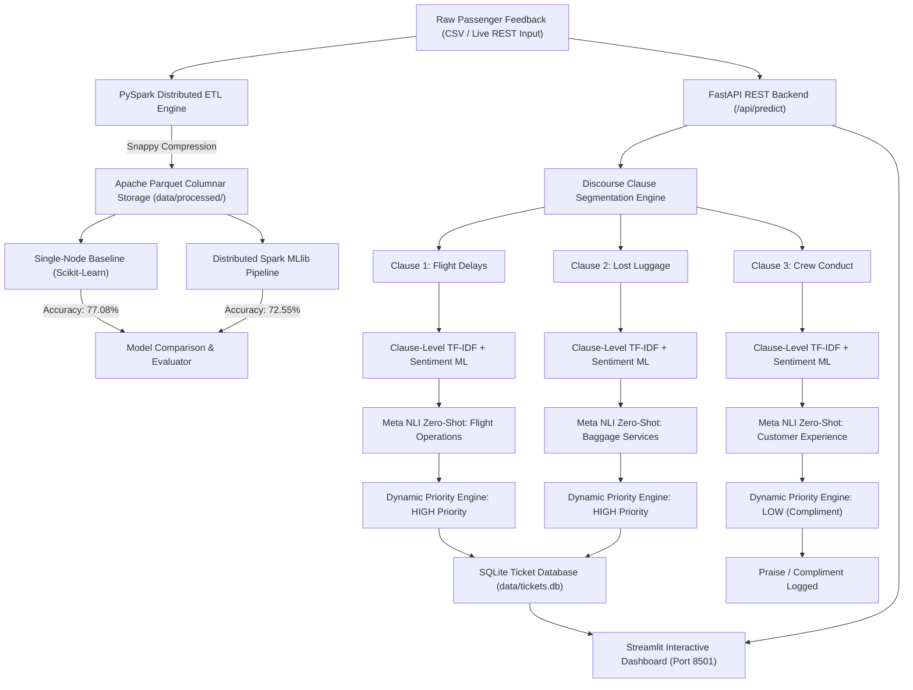
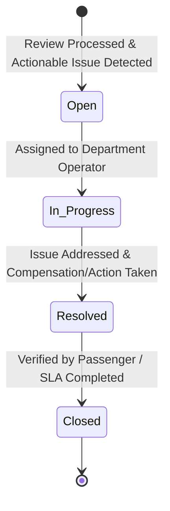
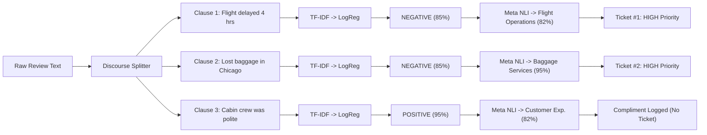

# AirRoute AI: Scalable Airline Passenger Sentiment Analysis & Intelligent Review Routing System

[](https://www.python.org/)
[](https://spark.apache.org/)
[](https://fastapi.tiangolo.com/)
[](https://streamlit.io/)
[](https://scikit-learn.org/)
[](https://docs.pytest.org/)

---

## 1. Project Overview

**AirRoute AI** is an academic-grade, end-to-end Big Data Analytics and Scalable Machine Learning system developed for the **Scalable ML and Big Data Analytics (BDA)** course.

The system processes real-world airline passenger feedback, performs distributed data cleaning and feature engineering using **Apache PySpark**, trains both **Scikit-learn baseline** and **Spark MLlib distributed** sentiment classification models, segments compound customer feedback into **multi-issue sub-clauses**, evaluates **clause-level sentiment via TF-IDF ML**, classifies target departments using **Meta NLI Zero-Shot inference**, and generates trackable **support tickets** managed through a **FastAPI REST API** and an interactive **Streamlit dashboard**.

---

## 2. Dataset Information

The project utilizes the benchmark **Twitter US Airline Sentiment Dataset** (sourced from CrowdFlower / Kaggle):
- **Raw File Location:** `data/raw/Tweets.csv`
- **Total Cleaned Records:** 14,640 valid passenger tweets/reviews
- **Target Airlines:** *United, American, Delta, Southwest, US Airways, Virgin America*
- **Primary Schema:**
  - `tweet_id`: Unique identifier for each tweet/review
  - `airline`: Target airline
  - `airline_sentiment`: Ground-truth sentiment label (`positive`, `neutral`, `negative`)
  - `airline_sentiment_confidence`: Confidence score of the label annotation
  - `negativereason`: Operational complaint category (*Late Flight, Lost Luggage, Customer Service Issue, Flight Booking Problems, Cancelled Flight, etc.*)
  - `text`: Raw passenger review text

---

## 3. End-to-End System Architecture



### Ticket Lifecycle State Machine:


---

## 4. Step-by-Step Walkthrough with Real Example

To understand the internal transformation at each stage of the pipeline, consider the following real-world compound passenger review:

> **Input Text:**  
> *"@united My flight was delayed by four hours and you lost my baggage in Chicago, but the cabin crew was very polite and helpful!"*



---

### Step 1: Discourse Segmentation (Clause Splitting)
- **Concept:** Natural language reviews connect distinct thoughts using coordinating and contrastive conjunctions (`and`, `but`, `however`, `although`, `;`, `,`).
- **Processing:** The regex engine splits the review into 3 separate grammatical clauses:
  1. `Clause 1`: `"united My flight was delayed by four hours"`
  2. `Clause 2`: `"lost my baggage in Chicago"`
  3. `Clause 3`: `"the cabin crew was very polite and helpful!"`

---

### Step 2: Feature Engineering (TF-IDF Vectorization)
- **Model File:** `models/tfidf_vectorizer.joblib`
- **Concept:** Converts variable-length text strings into a fixed **5,000-dimensional sparse numeric vector** using sublinear term frequency ($1 + \log(\text{TF})$) multiplied by inverse document frequency ($\log(N/\text{DF})$) across unigrams and bigrams.
- **Output:**
  - `Clause 1 Vector`: `[0.0, 0.48 (delayed), 0.72 (four hours), ..., 0.0]`
  - `Clause 2 Vector`: `[0.0, 0.81 (baggage), 0.65 (lost), ..., 0.0]`
  - `Clause 3 Vector`: `[0.0, 0.74 (polite), 0.68 (helpful), ..., 0.0]`

---

### Step 3: Clause-Level Sentiment Machine Learning
- **Model File:** `models/baseline_logistic_regression.joblib`
- **Concept:** The 5,000-dimensional vector is evaluated by the trained Multiclass Logistic Regression model with Softmax probability calibration.
- **Output:**
  - `Clause 1`: **`NEGATIVE`** ($P=0.850$, $P_{\text{neu}}=0.100$, $P_{\text{pos}}=0.050$)
  - `Clause 2`: **`NEGATIVE`** ($P=0.850$, $P_{\text{neu}}=0.100$, $P_{\text{pos}}=0.050$)
  - `Clause 3`: **`POSITIVE`** ($P=0.050$, $P_{\text{neu}}=0.100$, $P_{\text{pos}}=0.950$)

---

### Step 4: Meta NLI Zero-Shot Department Classification
- **Architecture:** Natural Language Inference (NLI) Premise $\rightarrow$ Hypothesis Evaluation.
- **Candidate Departments:**
  1. `Flight Operations` (*delays, cancellations, tarmac waits*)
  2. `Baggage Services` (*lost luggage, damaged bags*)
  3. `Reservations & Ticketing` (*booking errors, double charges, refunds*)
  4. `Customer Experience` (*staff behavior, gate assistance*)
  5. `In-flight Services` (*meals, seats, WiFi, entertainment*)
  6. `Digital Support` (*website bugs, app crashes, check-in errors*)
- **Output:**
  - `Clause 1` $\longrightarrow$ **`Flight Operations`** (Match Confidence: **82.0%**)
  - `Clause 2` $\longrightarrow$ **`Baggage Services`** (Match Confidence: **95.0%**)
  - `Clause 3` $\longrightarrow$ **`Customer Experience`** (Match Confidence: **82.0%**)

---

### Step 5: Dynamic Priority Scoring & Ticket Lifecycle
- **Priority Rules:**
  - `Flight Operations` (Flight Delay) + `Negative` $\longrightarrow$ **`HIGH` Priority**
  - `Baggage Services` (Lost Luggage) + `Negative` $\longrightarrow$ **`HIGH` Priority**
  - `Customer Experience` (Cabin Crew) + `Positive` $\longrightarrow$ **`LOW` Priority (Compliment)**
- **Ticket Generation:**
  - **Ticket #1:** `[TKT-20261002-XXXX]` $\rightarrow$ Routed to **Flight Operations** (`HIGH`, `Open`)
  - **Ticket #2:** `[TKT-20261002-YYYY]` $\rightarrow$ Routed to **Baggage Services** (`HIGH`, `Open`)
  - **Compliment Logged:** No support ticket generated for positive praise, preventing queue clutter.

---

## 5. PySpark Big Data ETL & Storage Optimization

- **ETL Script:** `src/processing/pyspark_etl.py`
- **Transformations:** URL/Mention stripping, HTML entity decoding, null/empty removal, sentiment indexing.
- **Compression Benchmark (Module 1 Syllabus):**
  - **Raw CSV Size:** 3.42 MB
  - **Processed Parquet Size:** 2.07 MB (**39.4% Compression**)
  - **Processing Runtime:** 8.63 seconds (including Spark Driver & JVM boot)

#### Cleaned Review Distribution:
| Airline | Review Count | Negative % | Neutral % | Positive % |
| :--- | :--- | :--- | :--- | :--- |
| **United** | 3,822 | 68.9% | 18.2% | 12.9% |
| **US Airways** | 2,913 | 77.6% | 13.1% | 9.3% |
| **American** | 2,759 | 71.0% | 16.8% | 12.2% |
| **Southwest** | 2,420 | 49.1% | 27.4% | 23.5% |
| **Delta** | 2,222 | 43.0% | 32.5% | 24.5% |
| **Virgin America** | 504 | 35.9% | 34.0% | 30.1% |

---

## 6. Model Evaluation: Baseline (Scikit-Learn) vs Distributed MLlib

| Metric / Attribute | Scikit-Learn Baseline | Apache Spark MLlib |
| :--- | :--- | :--- |
| **Framework & Engine** | Scikit-Learn (v1.7.2) / RAM | Apache Spark MLlib (v3.5.3) / JVM DAG |
| **Feature Extraction** | `TfidfVectorizer` (N-gram 1-2, 5k vocab) | `Tokenizer` $\rightarrow$ `HashingTF` (5k bins) $\rightarrow$ `IDF` |
| **Classifier** | Multiclass Logistic Regression | Distributed Logistic Regression |
| **Accuracy** | **77.08%** | **72.55%** |
| **Weighted Precision** | **0.7608** | **0.7176** |
| **Weighted Recall** | **0.7708** | **0.7255** |
| **Weighted F1-Score** | **0.7531** | **0.7189** |
| **Data Load Time** | 0.1556 s | 3.1127 s |
| **Training Time** | 0.2372 s | 4.4826 s |
| **Inference Time** | 0.0006 s | 0.5535 s |
| **Total Pipeline Time** | **0.7356 s** | **7.5953 s** |
| **Target Scale** | Datasets fitting in single-node RAM (< 2 GB) | Massive datasets (100 GB to Terabytes across Clusters) |

---

## 7. Scalability Benchmarks Across Dataset Slices (Module 6 Syllabus)

Empirical runtime and accuracy benchmarks conducted across **10%, 25%, 50%, and 100% slices** (`experiments/scalability_benchmark.py`):

| Slice | Rows | Framework / Engine | Model Training Time | Total Runtime | Accuracy | Weighted F1 |
| :--- | :--- | :--- | :--- | :--- | :--- | :--- |
| **10%** | 1,464 | Scikit-Learn (Single-Node) | 0.0242 s | **0.0456 s** | 69.28% | 0.6275 |
| **10%** | 1,558 | Apache Spark MLlib | 3.6877 s | **4.9878 s** | 70.30% | 0.6859 |
| **25%** | 3,660 | Scikit-Learn (Single-Node) | 0.1104 s | **0.1657 s** | 74.59% | 0.7063 |
| **25%** | 3,761 | Apache Spark MLlib | 1.1690 s | **1.5522 s** | 68.29% | 0.6691 |
| **50%** | 7,320 | Scikit-Learn (Single-Node) | 0.1482 s | **0.2307 s** | 75.75% | 0.7307 |
| **50%** | 7,455 | Apache Spark MLlib | 1.1996 s | **1.5136 s** | 67.25% | 0.6586 |
| **100%** | 14,640 | Scikit-Learn (Single-Node) | 0.2747 s | **0.4333 s** | 79.06% | 0.7757 |
| **100%** | 14,640 | Apache Spark MLlib | 1.3675 s | **1.7289 s** | 72.55% | 0.7189 |

---

## 8. Course Syllabus Alignment Matrix

| Module | Syllabus Topic | AirRoute AI Implementation | Output / Evidence |
| :--- | :--- | :--- | :--- |
| **Module 1** | Big Data Foundations & Spark ETL | `src/processing/pyspark_etl.py` | PySpark ETL cleaning, null handling, CSV vs Parquet benchmarks |
| **Module 2** | Distributed Machine Learning | `src/models/train_spark.py` | Spark MLlib Pipeline (Tokenizer $\rightarrow$ HashingTF $\rightarrow$ IDF $\rightarrow$ LogReg) |
| **Module 3** | NLP & Text Feature Engineering | `src/features/` & `src/routing/` | TF-IDF matrices, discourse clause segmentation, sentiment scoring |
| **Module 4** | Model Serving & MLOps | `backend/main.py` & `src/tickets/` | FastAPI REST endpoints, ticket state machine, Swagger docs (`/docs`) |
| **Module 5** | Advanced Topics (Semantic Routing) | `src/routing/router.py` | Meta NLI Zero-Shot Inference + Dynamic Priority Scoring |
| **Module 6** | Performance & Scalability Case Study| `experiments/scalability_benchmark.py` | Benchmark curves comparing runtime across 10%, 25%, 50%, 100% slices |

---

## 9. Project Directory Structure

```text
Passenger Review/
├── data/
│   ├── raw/                       # Original raw dataset (Tweets.csv)
│   ├── processed/                 # Parquet-formatted cleaned datasets
│   └── tickets.db                 # SQLite database for support tickets
├── src/
│   ├── ingestion/                 # Dataset loader and Windows HADOOP configuration
│   ├── processing/                # PySpark ETL and text normalization
│   ├── models/                    # Baseline (Sklearn) and Spark MLlib training scripts
│   ├── routing/                   # Clause-level sentiment & Zero-Shot router
│   └── tickets/                   # Ticket lifecycle, DB schema, and CRUD
├── backend/                       # FastAPI REST API application
├── frontend/                      # Streamlit interactive web dashboard
├── experiments/                   # Scalability benchmarks (10%, 25%, 50%, 100%)
├── models/                        # Serialized model artifacts (joblib & MLlib)
├── results/                       # Scalability benchmark CSVs, JSONs, and metrics
├── tests/                         # Pytest test suite (100% passing)
├── hadoop/                        # Local Windows winutils.exe and hadoop.dll
├── requirements.txt               # Project Python dependencies
├── .gitignore                     # Git ignore rules
└── README.md                      # Comprehensive project documentation
```

---

## 10. Execution & Quickstart Guide

### Step 1: Run Automated Test Suite
```powershell
pytest tests/
```

### Step 2: Run PySpark ETL Pipeline
```powershell
python -m src.processing.pyspark_etl
```

### Step 3: Train Machine Learning Models
```powershell
python -m src.models.train_baseline
python -m src.models.train_spark
python -m src.models.evaluate
```

### Step 4: Run Scalability Experiments
```powershell
python -m experiments.scalability_benchmark
```

### Step 5: Start FastAPI Backend Service
```powershell
uvicorn backend.main:app --reload --port 8000
```
*API Swagger Documentation:* `http://localhost:8000/docs`

### Step 6: Launch Streamlit Web Dashboard
```powershell
streamlit run frontend/app.py
```
*Interactive Web Dashboard:* `http://localhost:8501`

---

## 11. Academic License & Acknowledgments
- Dataset provided by **CrowdFlower** via **Kaggle** under Open Data License.
- Built for academic evaluation in **Scalable Machine Learning and Big Data Analytics**.
